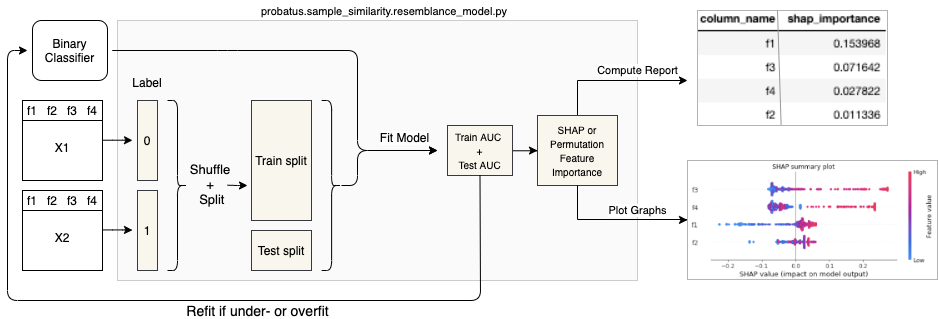

# Adversarial Validation

Detecting feature drift is crucial for maintaining model performance in dynamic environments. This repository provides an implementation of Adversarial Validation, a technique proposed in the research [paper](https://arxiv.org/abs/2004.03045), to identify changes in feature distributions between training and test datasets. This technique involves training a binary classification model that distinguishes between train and test samples. If the classifier achieves high performance (e.g., ROC AUC > 0.5), it suggests that the most important features for the model are also the ones that have changed between training and testing stages.

So under the assumption that a change on the distribution of a feature or a group of features may impact negatively the model performance, it is reccomended to eliminate the features recursively until we achive the classifer to have a performance close to random.

Diagram below shows the general idea. 

The original source of the image may be found [here](https://ing-bank.github.io/probatus/tutorials/nb_sample_similarity.html)




# Usage

1. Setup: Install the required dependencies and import necessary libraries.

```pip install -r requirements.txt```

2. **AdversarialValidation Class:** The AdversarialValidation class encapsulates the entire process. It can be initialized with parameters to specify the feature columns, base estimator, time column (if applicable), training end date, and more.

3. **Creating an Instance:** Instantiate the AdversarialValidation class with appropriate parameters.

```adversarial_validator = AdversarialValidation(
    features=["feature_1", "feature_2"],
    base_estimator=None,
    time_column="timestamp",
    train_end_date="2022-01-01",
    is_train_column=None,
    test_size=0.2,
    random_state=42
)
````
4. **Training:** Use the fit method to train the adversarial validation model.

```adversarial_validator.fit(frame=dataframe, estimator_params={"random_state": 42})```

5. **Prediction:** Predict whether samples come from the train or test set using predict method.

```predictions = adversarial_validator.predict(new_data)```

6. **SHAP Value Analysis:** Visualize SHAP values to understand feature importance.

```adversarial_validator.plot_shap_values()```

7. **Feature Elimination:** Perform recursive feature elimination to identify drifting features.

```
elimination_results = adversarial_validator.recursive_feature_elimination(
    frame=dataframe, n_features_remove=5, threshold_remove_until=0.5
)
```

8. **Save Model:** Save the trained adversarial validation model.

```
adversarial_validator.save_model(model_path="../model-files/", model_name="adversarial_classifier")`
```

# Conclusion

Adversarial Validation is a powerful technique to identify feature drift between training and test datasets. This repository provides an easy-to-use implementation of the technique, along with helpful functions to visualize feature importance and identify drifting features. Use this tool to ensure your model's performance remains consistent over time and across different datasets.


